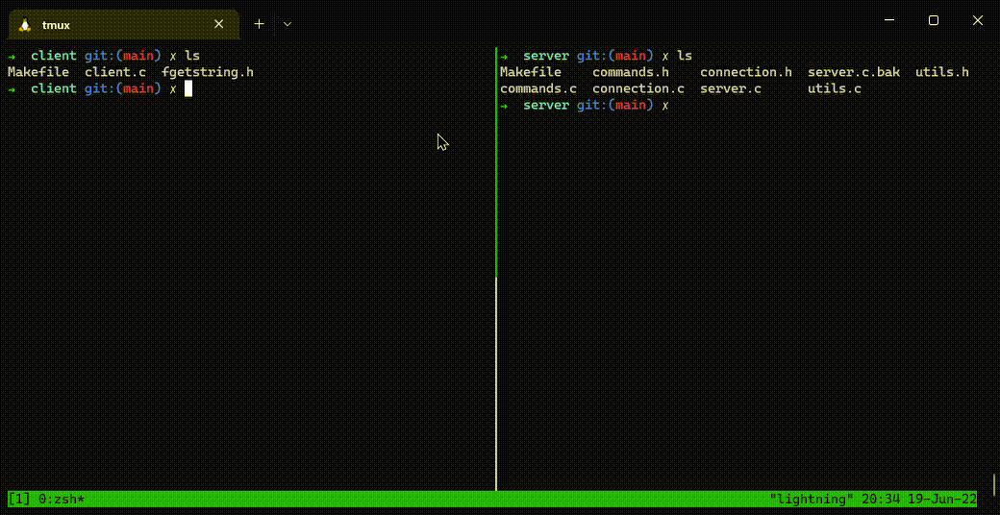

# Redes de Computadores - Trabalho final

O trabalho final da disciplina de Redes de Computadores está especificado no documento `Especificacao_Trabalho_Redes_2022.pdf`.

**Membros do grupo**
- João Pedro Gavassa Favoretti (11316055)
- Lucas Pilla Pimentel (10633328)

### Implementação de um IRC (Internet Relay Chat)

Existem dois programas diferentes que compõe o IRC, o cliente e o servidor.

A aplicação `servidor` é utilizada para centralizar as requisições por conexões e lidar com a interpretação de comandos e execução de funcionalidades.

Os modulos que se tornam a aplicação servidora estão na pasta `server` enquanto os módulos que se compoõe a aplicação cliente estão na pasta `client`.

Cada uma das aplicações possuem comandos `Makefile` para facilitar compilação e execução, eles ficarão mais claros mais para frente.

**Compilação dos programas**

Na hora de realizar o desenvolvimento dos programas, foi utilizado o gcc na versão:

```
➜  client-server-model gcc --version
gcc (Ubuntu 9.4.0-1ubuntu1~20.04.1) 9.4.0
Copyright (C) 2019 Free Software Foundation, Inc.
This is free software; see the source for copying conditions.  There is NO
warranty; not even for MERCHANTABILITY or FITNESS FOR A PARTICULAR PURPOSE.
```

Para realizar a compilação do programa `server` é necessário ir no diretório `/server` e utilizar o comando:

```
make compile
```

Do mesmo modo para realizar a compilação do programa `client` é necessário ir no diretório `/client` e utilizar o comando:

```
make compile
```

No fim desses processos, os arquivos `/server/server` e `/client/client` deverão ter sido criados.

**Exemplo de compilação**



**Execução**

Por padrão o servidor utiliza o endereço 0.0.0.0 do seu computador. Ou seja, ele utiliza todas as interfaces disponíveis para realizar comunicação. Isso significa que é possível utilizar tanto o endereço associado à sua interface eth0 quanto a interface de loopback para realizar conexôes no chat.

Dentro dos comandos Makefile foi utilizado o endereço 127.0.0.1 (provido pela interface de loopback) para realizar as conexões. Além disso estamos utilizando a porta 47783 do seu computador para realizar conexões. Esse número foi gerado aleatóriamente para dificultar que existam processos utilizando a mesma porta no mesmo instante. Caso haja erro na hora de executar os programas, isso pode ser checado.

Depois dos exclarecimendos, vamos para a execução dos programas.

Antes de iniciar os processos clientes, é necessário estar com o processo server rodando. Para isso, com um terminal separado, entre na pasta `/server` e execute o comando:

```
make run
```

Esse processo estará em controle do terminal utilizado. Para executar os programas clientes é necessário utilizar outro terminal ou deixar o programa em background. Depois disso, para executar um processo cliente é necessário entrar na pasta `/client` com a aplicação compilada e executar o comando:

```
make run
```

Observer que o servidor nesse caso não server para enviar input para os usuários. Para realizar comunicação entre usuários é necessário abrir outro terminal e utilizar o mesmo comando `make run` para gerar outro cliente ligado ao servidor

Depois disso as aplicações clientes estarão conectadas ao servidor, mas não à uma sala de chat com outros usuários.

Por enquanto é possível utilizar os comandos

- `/ping` - Para receber uma resposta do servidor
- `/quit` - Para sair do programa
- `/join <nome da sala>` - Para entra/criar uma sala
- `/nickname <nickname>` - Para trocar de apelido
- `/help` - Para exibir todos os comandos suportados pelo servidor (incluindo os comandos voltados para usuários administradores da sala)

Ao se conectar ao servidor, o seu apelido será automaticamente atribuido como "client_" seguido do file descriptor associado à aplicação servidora ao realizar a conexão com seu terminal. Para alterar esse apelido é necessário utilizar o comando `/nickname` que irá alterar seu nickname em todas as salas que você está conectado.

Como mostrado acima, é necessário utilizar o comando `/join` e depois especificar o nome de uma sala. Caso a sala com mesmo nome não exista, ela será criada e você será o administrador. Caso voce saia, a sala será excluida em seguida.

Como administrador, é possível utilizar os seguintes comandos utilizando o nickname:

- `/kick <nickname>`
- `/mute <nickname>`
- `unmute <nickname>`
- `whois <nickname>`

**Exemplo de execução**

Aqui está um exemplo gravado dos passos comentados de compilação e execução dos programas


**Informações extras**

Caso desejado, o arquivo Makefile foi feito com a opção de compilação dos programas em modo DEBUG. Nesse modo a execução exibe informações adicionais sobre conexões estabelecidas dados enviados e recebidos.

Para isso utilize o seguinte comando:

```
make compile-debug
```

Para a compilação dos programas em ambas as pastas `/server` e `/client` ao inves do comando mostrado anteriormente (`make compile`).

