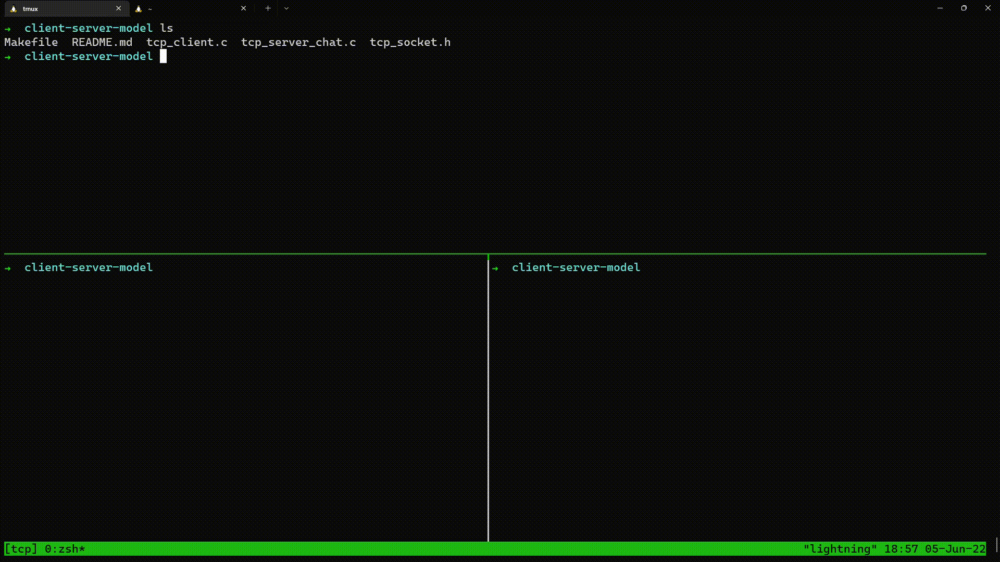

# Redes de Computadores - Trabalho final

O trabalho final da disciplina de Redes de Computadores está especificado no documento `Especificacao_Trabalho_Redes_2022.pdf`.

**Membros do grupo**
- João Pedro Gavassa Favoretti (11316055)
- Lucas Pilla Pimentel (10633328)

## Primeira entrega

Na primeira entrega é necessário criar um conjunto de programas que realizam a troca de mensagens utilizando a API de sockets fornecida pelo Linux utilizando uma conexão TCP.

### Client Server Model

Dentro da pasta `client-server-model` está contido os módulos necessários para realizar a conexão.

Além disso é possível utilizar comandos `Makefile` para realizar a compilação e execução mais facilmente.

A ideia da implementação utilizando o modelo client-server foi que existirá um processo central (server) que espera conexões, enquanto outros processos usuários (client) que tentam realizar conexão com o server para iniciar a comunicação com outros usuários.

Para isso é necessário compilar e executar separadamente os programas que serão utilizados como client e server.

**Compilação**

Na hora de realizar o desenvolvimento dos programas, foi utilizado o gcc na versão:

```
➜  client-server-model gcc --version
gcc (Ubuntu 9.4.0-1ubuntu1~20.04.1) 9.4.0
Copyright (C) 2019 Free Software Foundation, Inc.
This is free software; see the source for copying conditions.  There is NO
warranty; not even for MERCHANTABILITY or FITNESS FOR A PARTICULAR PURPOSE.
```

Agora, para compilar o programa que será utilizado como server, é necessário entrar na pasta client-server-model e utilizar o comando:

```
make compile-server
```

Do mesmo modo para compilar o programa que será utilizado como client, é necessário entrar na pasta client-server-model e utilizar o comando:

```
make compile-client
```

No fim desses dois passos, dois programas: `tcp_client_chat` e `tcp_server_chat` deverão ter sido criados no diretório `client-server-model`.

**Execução**

Por padrão o servidor utiliza o endereço 0.0.0.0 do seu computador. Ou seja, ele utiliza todas as interfaces disponíveis para realizar comunicação. Isso significa que é possível utilizar tanto sua interface eth0 quanto a interface de loopback para realizar conexôes no chat.

Dentro dos comandos Makefile foi utilizado o endereço 127.0.0.1 (provido pela interface de loopback) para realizar as conexões. Além disso estamos utilizando a porta 47783 do seu computador para realizar conexões. Esse número foi gerado aleatóriamente para dificultar que existam processos utilizando a mesma porta no mesmo instante. Caso haja erro na hora de executar os programas, isso pode ser checado.

Depois dos exclarecimendos, vamos para a execução dos programas.

Antes de iniciar os processos clientes, é necessário estar com o processo server rodando. Para isso é necessário utilizar o comando:

```
make run-server
```

Esse processo estará em controle do terminal utilizado. Para executar os programas clientes é necessário utilizar outro terminal ou deixar o programa em background. Depois disso, para executar um processo cliente é necessário utilizar o comando:

```
make run-client
```

Observer que o servidor nesse caso não server para enviar input para os usuários. Para realizar comunicação entre usuários é necessário abrir outro terminal e utilizar o mesmo comando `make run-client` para gerar outro cliente.

Depois disso você terá dois processos clientes "na mesma sala" e poderá enviar mensagens de um para o outro utilizando o próprio teclado ligado ao terminal.

**Exemplo de execução**

Aqui está um exemplo gravado dos passos comentados de compilação e execução dos programas


